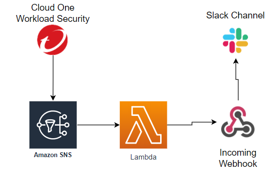

## Trend Micro Cloud One integration with SNS for Deliver Events to Slack Channel 

This is an Example for send Events of Cloud One Workload Security with Webhook like Slack, Teams, Discord with AWS SNS integration.

This example is build for Slack

# Requirements:

> SNS Topic and Integrated with [Cloud One Workload Security](https://cloudone.trendmicro.com/docs/workload-security/event-sns/)

> [AWS account integrated in Workload Security](https://cloudone.trendmicro.com/docs/workload-security/aws-add/)

> [Incomming Webhook in Slack](https://api.slack.com/messaging/webhooks)

## TO-DO

- [x] Lambda with Events
- [ ] Cloud Formation Template
- [ ] Video

## Contributing
If you encounter a bug, think of a useful feature, or find something confusing in the docs, please create a new issue! We ❤️ pull requests.

